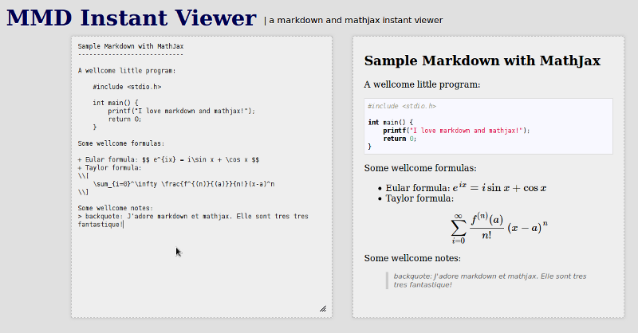

# MMD Instant Viewer
--------------------

MMD stands for 'MathJax and MarkDown'. This instant viewer is for those who uses markdown to write blog and mathjax to post formulas. For myself, I may make a bunch of little mistakes when I use latex. Hence I write such an instant viewer so that I can check the display result the time when I type the formulas in latex. This is such an easy tool with less than 20 lines of code, but I think it helps me a lot in blog writing.

